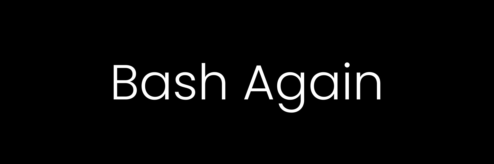

 
In this section we'll create a script (lets call it as `setup`) in `$HOME` directory to automate all the installations and other setup. Lets make a list of bins (available on brew) and casks that we want to install. In the `setup` file add two array - `bins` and `casks`.
```bash
#!/bin/bash

# Brew casks and binaries that you need
bins = (
    "nvm"
    "php@7.4"
    "composer"
    # more valid brew formula here
)

casks=(
    "slack"
    "postman"
    # add brew casks that you need 
)
```

## Compilers and Interpreters

The first thing in the setup for any type of software development should be getting the language support - installating the compiler, interpreters etc. If you are on MacOS, the easiest way is to download and install Xcode or Xcode Command Line.

I prefer Xcode Command line tools because it is compact(~1GB) and vim or vscode are enough for most of my work. But if you need a fully featured IDE and other features go ahead with Xcode(~8-10GB).

Xcode can be easily installed form App Store, and for Xcode command line tools the installation is also simple, just run the following command in terminal

```bash
# ########################################################################## # 
#                   /!\ Compilers and Interpreters /!\                       # 
# ########################################################################## # 
if xcode-select -p 1>/dev/null
then
    echo "xcode-command line tools already installed"
else
    xcode-select --install
fi
```

## System Package Manager - Homebrew

The installation of libraries and apps should be simple and automated, Homebrew - The Missing Package Manager for MacOS is one popular package manager, the installation is just one command but requires xcode-select to be pre-installed (see more at brew.sh).

```bash
# ########################################################################## # 
#                       /!\ System Package Manger  /!\                       # 
# ########################################################################## # 
if brew -h 1>/dev/null
then
    echo "Brew.sh already installed."
else
    echo /bin/bash -c "$(curl -fsSL https://raw.githubusercontent.com/Homebrew/install/master/install.sh)"
fi

# Update to latest brew version.
brew update

# Upgrade all the installed formula
brew upgrade
```

## Binaries and Casks Installation

```bash
# ########################################################################## # 
#                          /!\ Binaries and Casks /!\                        # 
# ########################################################################## # 
export PATH="$(brew --prefix coreutils)/libexec/gnubin:/usr/local/bin:$PATH"

for binary in "${bins[@]}"
do
    # get the name of the binary (ex- php in php@7.4)
    b=`echo $binary | cut -d \@ -f 1`
    # check if the binary is already present, otherwise install
    if brew list --formula | grep "$b" 1>/dev/null
    then
        echo "$binary already installed"
    else
        brew install "$binary"
    fi
done

for c in "${casks[@]}"
do
    # check is cask is present or not, if not install
    if brew list --cask | grep "$c" 1>/dev/null
    then
        echo "$c is already installed"
    else
        brew casks install "$c"
    fi
done
```


