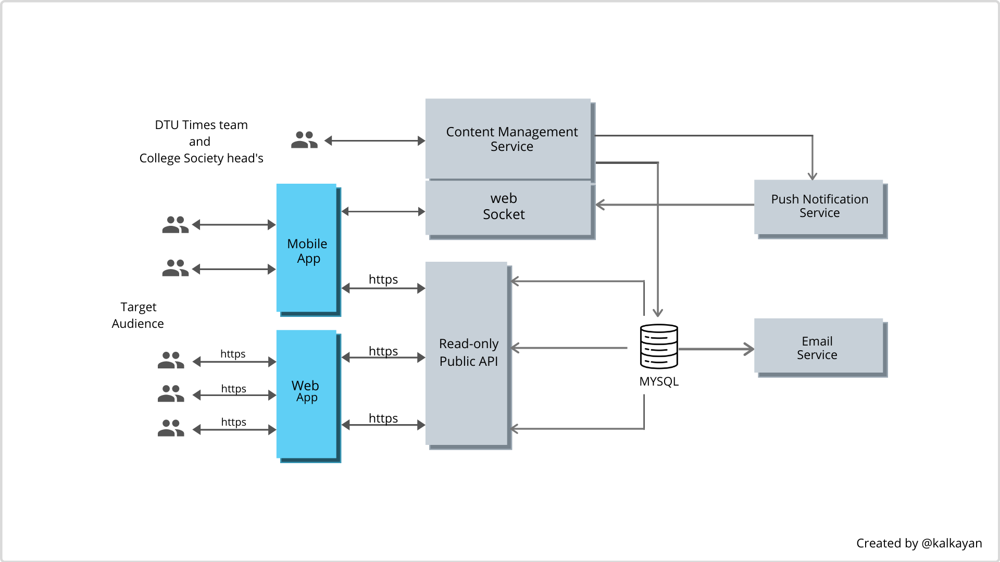

DTU Times is the official university newsletter of Delhi Technological University, Bawana, Delhi. We are a team of 70 people, among which seven are responsible for the development of Web and Mobile APP.

DTU Times’s technology may look like a simple blog application but, for a university newsletter, it has a significantly large infrastructure consists of many services.

Like most web-based blogs, the DTU Times backend started as a “monolithic” software with some servers and a single database.

The system was mainly written in PHP and used Eloquent as the ORM layer to the database. The original architecture was fine until we started growing and adding new features and integrations. We also decided to provide our publications on the mobile app, and this led us to redesign the DTU Times backend into a more modular, Service-oriented system.

The new DTU Times is not just designed to serve the web. Instead, it is designed to serve web and mobile apps at the same time. We divided our large monolithic system into three main sections — Content Management System, Public API, and User App(React Web and Mobile Apps).

# Content Management Service

The Content Management Service or as we like to call it “The backdoor of DTU Times” is the heart of the DTU Times backend System where all the magic happens, this is the place where all the columnists, photographers, and illustrators create content out of thin air.

This is a content management system that is custom built to satisfy the needs of the content generation team. It includes features like Access Control List (ACL ~ different users have different roles and permissions), Blog writing, Gallery, Image optimization, Section for Society Page and their News, and Bulk Email Sending to Subscribers.

The Backdoor portal is built on Laravel (5.7) (open source PHP framework based on Symphony) with Mysql and is running on PHP 7.2. The service portal is running on app.dtutimes.com.

# Public API

The DTU Times Public API is the interface connecting Web and Mobile App with the backend system. It is a stateless read-only REST API and designed for the sole purpose of providing content to the DTU Times Web and Mobile APP. We developed this API so that both apps can use a standard interface, and any new development/change to the CMS doesn’t affect the web and mobile app.

The API provides content for Editions, Articles, Gallery, Society News, Society Pages, DTU Times Facebook Feed, and DTU Times Team members info.

The Public API is also built with Laravel (5.8) and is running on PHP 7.2. And it uses the very same Mysql database. The API is live and running on api.dtutimes.com.

# User Interface

DTU Times provides mobile(IOS and Android) as well as a web app for its content distribution. These apps are the most critical part of our system because it what we deliver to the users to ensure good user experience. We have built these apps on ReactJS (core and Native) and optimized to load content over slow internet.

The web app is hosted at the university provided domain name dtutimes.dtu.ac.in. And has the following sections — Edition, Blog, Gallery, Society Pages, Society News, Team, and Contact Us. This is hosted on dtutimes.dtu.ac.in and dtutimes.com.

The Mobile app is built with Expo and React Native, and have Blog, Edition, Facebook Feed sections, with features like Event Updates, Society News that uses the push notification.