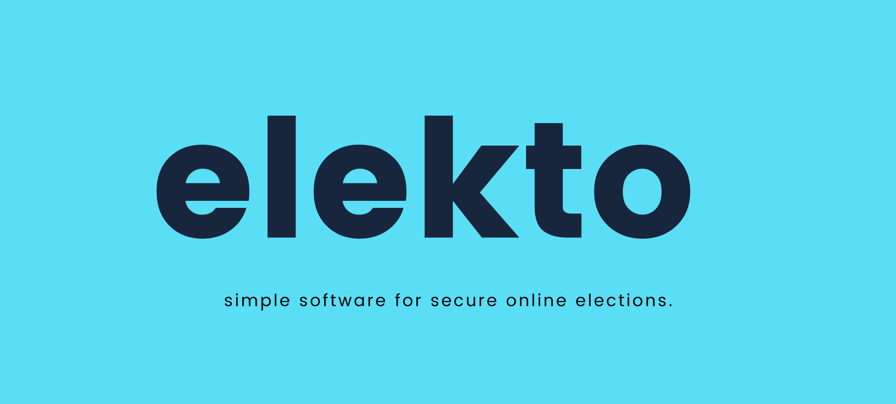
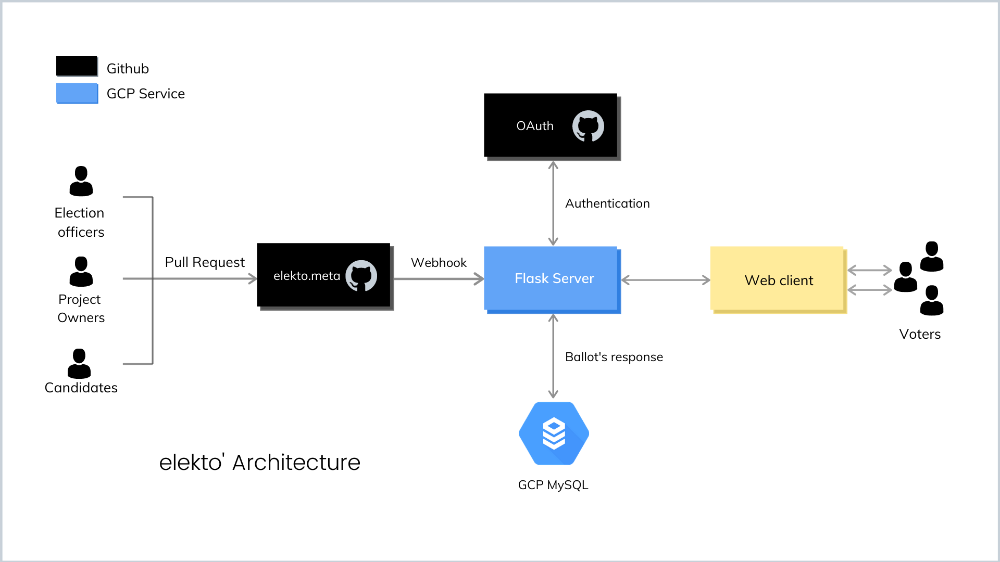
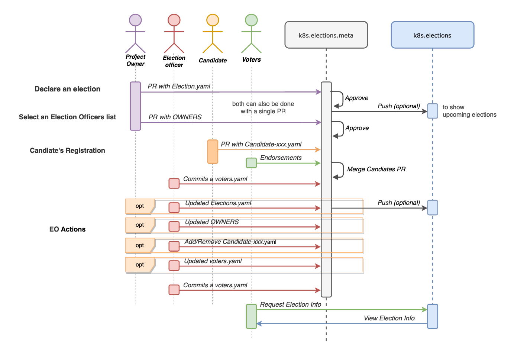
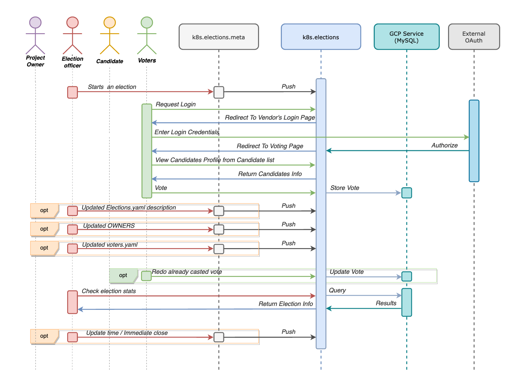
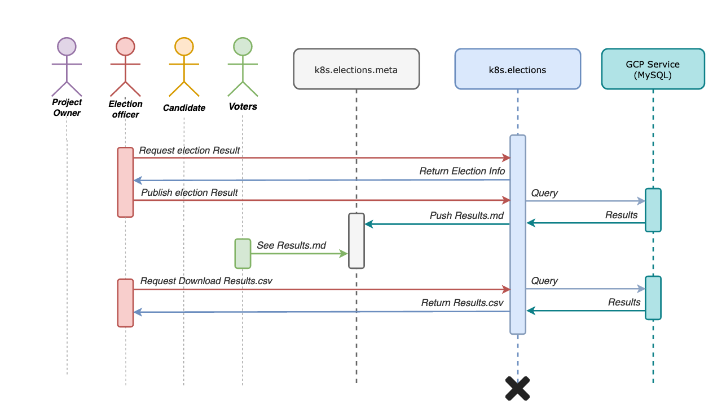

The Elekto Project develops Elekto, simple software for secure online elections. Elekto was created as part of an LFX internship for the Kubernetes project under the guidance of [Josh Berkus](https://mentorship.lfx.linuxfoundation.org/mentor/681bd33c-52c8-450e-97d6-cf95d3493ac6), [Marky Jackson](https://mentorship.lfx.linuxfoundation.org/mentor/cbceda22-d448-4121-adc1-c4f793291bea), [Sergey Kanzhelev](https://mentorship.lfx.linuxfoundation.org/mentor/20ddefe1-872a-4077-ba0c-f85ebdfb7fd5), and is now a CNCF infrastructure project.

The general idea of the application is shown below. A seperate repository - k8s.elections.meta is maintained to keep track of all the meta files (.yaml) for elections, this repository serves as the single source of truth for the application's operation which is operated by gitops model. All the adminstrative tasks like creation of new elections, updation of voter's list, register of a candidate profile etc will be performed by raising specific pull requests in this repository. 

After rasing a pull request, the gitops-bot will push events to the k8s.elections application (flask server) via web hooks. k8s.elections server is responsible for conducting the elections, receiving responses and computing the results.

The voters can only interact (browse/vote elections) with the application only after authenticated by an external OAuth vendor (ex - github, gitlab). The results of these ballots are stored in a MySQL Database running as GCP Service.

# Workflow

The workflow of the application is divided in three sections depending on the stage of the election, which are 

### Before election started

This parts is majorly handled with gitops, i.e., mostly adminstrative. Below is an sequence diagram to show the workflow for declare an election and other EO related tasks.

|  |
| ------ |

### Election in progress

The Election officers starts the election, and now the voters can login with their github to view the election info, candidates list, a candidates profile page and then vote.

While the election is running the election officers can view the election stats several times from UI, and closes the election after the voting deadline is over.

|  |
| ------ |
<!-- |  |
| ------ | -->

### After Election

After the election ends an EO can see full election results in the web interface (only accessable to EOs), then push public election results to results.md file for voter to see.

An EO can also download a CSV or YAML file of private election results for archiving that Would include same information as the full election results.

|  |
| ------ |